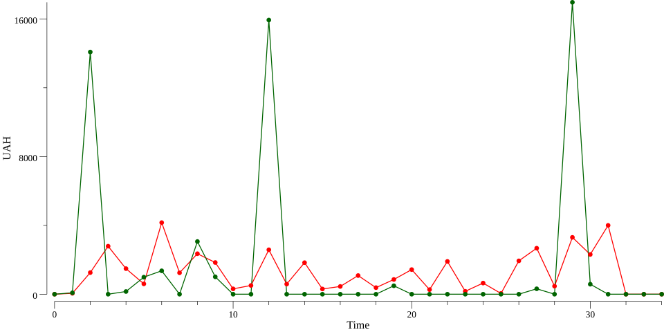

# MonoBank SDK

[godoc]: https://godoc.org/github.com/shal/mono
[godoc-img]: https://godoc.org/github.com/shal/mono?status.svg

[ci]: https://circleci.com/gh/shal/mono
[ci-img]: https://circleci.com/gh/shal/mono.svg?style=svg

[goreport]: https://goreportcard.com/report/github.com/shal/mono
[goreport-img]: https://goreportcard.com/badge/github.com/shal/mono

[version]: https://img.shields.io/github/v/tag/shal/mono?sort=semver

[![Circle CI][ci-img]][ci]
[![Docs][godoc-img]][godoc]
[![Go Report][goreport-img]][goreport]
[![Version][version]][version]

:bank: Golang client for [Mono API](https://api.monobank.ua/docs/).

## Install

This package has no dependencies, install it with command below

```sh
go get github.com/shal/mono
```

## Usage

You can find documentation for all types of API [here](./docs).

Documentation

1. [Public API](./docs/public.md)
2. [Personal API](./docs/personal.md)
3. [Coraporate API](./docs/corporate.md)

##

```go
package main

import (
    "fmt"
    "os"
    "time"

    "github.com/shal/mono"
)

func main() {
    personal := mono.NewPersonal("token ")

    user, err := personal.User()
    if err != nil {
        fmt.Println(err.Error())
        os.Exit(1)
    }

    from := time.Now().Add(-730 * time.Hour)
    to := time.Now()

    var account mono.Account

    for _, acc := range user.Accounts {
        ccy, _ := mono.CurrencyFromISO4217(acc.CurrencyCode)
        if ccy.Code == "UAH" {
            account = acc
        }
    }

    transactions, err := personal.Transactions(account.ID, from, to)
    if err != nil {
        fmt.Println(err.Error())
        os.Exit(1)
    }

    fmt.Printf("Account: %s\n", account.ID)

    fmt.Println("Transactions:")
    for _, transaction := range transactions {
        fmt.Printf("%d\t%s\n", transaction.Amount, transaction.Description)
    }
}
```

More about this example [here](./examples/personal/main.go).



## Contributions

You can send me some tips to [MonoBank](https://send.monobank.com.ua/2FVYpRHoi), if this package was useful.

## License

Project released under the terms of the MIT [license](./LICENSE).
